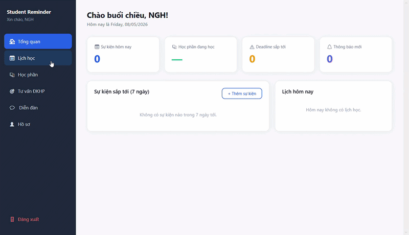
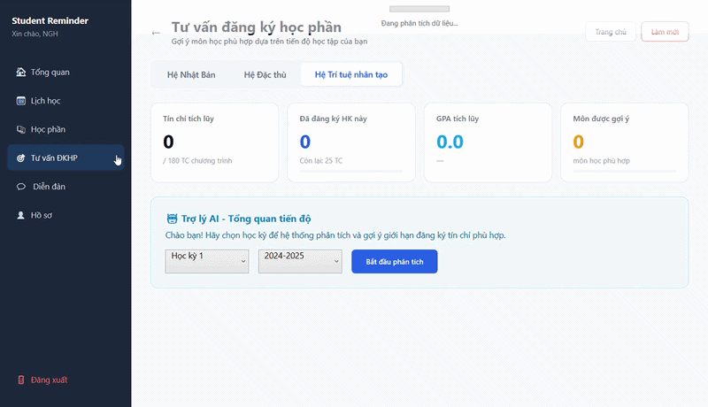

# 🎓 Student Reminder & Advisor

> Trợ lý học tập thông minh: Tự động hóa nhắc nhở lịch trình & tư vấn đăng ký học phần, giúp sinh viên tối ưu hóa lộ trình tích lũy tín chỉ.

  
  

 

## ✨ Highlights

- **Smart Course Advisor:** AI tự động gợi ý & đăng ký học phần dựa trên mức tín chỉ giới hạn, điểm số GPA và khung thời gian ưu tiên.

  

- **Auto-Reminders:** Hệ thống hàng đợi (Queue) tự động nhắc nhở lịch thi, deadline & sự kiện cá nhân qua kênh Push/Email.
- **Student Forum:** Tích hợp không gian thảo luận với tính năng share bài, comment, like (xử lý concurrency chặt chẽ qua Constraints & Stored Procedures).
- **Security:** Xác thực & ủy quyền 2 lớp (Admin/Student), bảo mật dữ liệu với cơ chế mã hóa `BCrypt.Net`.
- **High Performance:** Triển khai theo mô hình 3 lớp (3-Tier), tối ưu truy xuất SQL Server bằng ADO.NET trực tiếp thay vì các ORM cồng kềnh.
